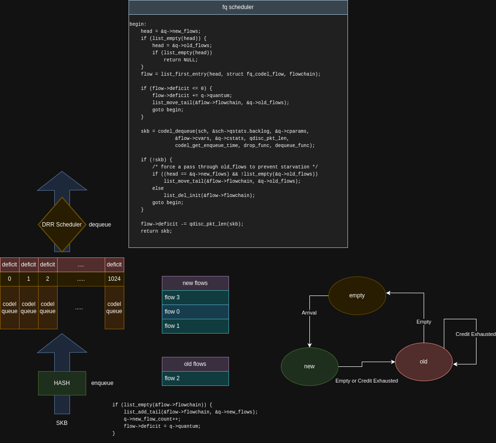

# Bandwidth Conscious QoS
## Environment - Edge Computing Gateway

## Requrements
| SSID        | VLAN ID | Priority | Description           |
|-------------|---------|-----------|----------------------|
| SSID 1      | VLAN 10 | 1         | Management Network   |
| SSID 2      | VLAN 20 | 2         | IoT Devices Network  |
| SSID 3      | VLAN 30 | 3         | Staff Network        |
| SSID 4      | VLAN 40 | 4         | Guest Network        |

## Hirarchical Queuing Discipline

### The Flow Queue CoDel Packet Scheduler

## Bandwidth Detection

### ECHO Request Message
| Counters | Description                                        |
|---------------|---------------------------------------------------|
|S                | the TX counter when ECHO-Req1 to be sent |
|R                |  the RX counter when ECHO-Req1 to be received |
|S'               | the TX counter when ECHO-Req2 to be sent |
|R'              | the RX counter when ECHO-Req2 ro be received |

### ECHO Response Message

## Results
### tap0 with `qdisc pfifo` (default) +  4 tcp flows

### tap0 with `qdisc htb + 4 classes (fq_codel)` + 4 tcp flows

